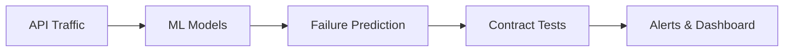

# ApiCortex: Autonomous API Failure Prediction & Contract Testing Platform

## 1. Introduction
Modern software systems rely heavily on APIs across internal teams and third-party providers. API failures often occur due to upstream changes, traffic spikes, or undocumented dependencies, leading to production outages.

**ApiCortex** is an AI-powered API intelligence platform that predicts failures before they occur and continuously validates API contracts using real traffic patterns.

## 2. Problem Statement
- **Reactive Debugging:** API failures are often detected only *after* outages occur.
- **Incomplete Testing:** Manual contract testing fails to cover all edge cases.
- **Lack of Prediction:** No existing predictive monitoring for API health.
- **High Risk:** Microservice ecosystems face high operational risks due to complex dependencies.

## 3. Proposed Solution
We are building a cloud platform that:
- Monitors API traffic, latency, and error patterns in real-time.
- Learns "normal" API behavior using Machine Learning.
- Predicts the probability of future failures.
- Automatically generates and executes contract tests.
- Alerts teams with actionable, explainable insights.

## 4. Key Objectives
- **Prevent API-related outages** before they impact users.
- **Detect breaking changes** early in the development cycle.
- **Improve service reliability** across the entire stack.

## 5. Key Features

### i. API Telemetry Collection
- Real-time traffic monitoring.
- Granular latency and error metrics.

### ii. Behavioral Modeling
- ML models that learn and adapt to normal API usage patterns.

### iii. Failure Prediction Engine
- Advanced anomaly detection and risk scoring to foresee issues.

### iv. Contract Testing Automation
- Auto-generated tests based on observed real-world behavior, keeping contracts up-to-date automatically.

### v. Developer Dashboard
- Centralized view of API health scores.
- Failure predictions and trend analysis.
- comprehensive test results.

## 6. End-to-End Architecture

## 7. Real-World Use Case
*Scenario:* An upstream service commits a schema change.  
*Outcome:* ApiCortex predicts an upcoming API failure caused by this change and alerts the dependent teams **before** deployment, preventing a production incident.

## 8. Contact
- **Email:** mail@0xarchit.is-a.dev
- **Contact Form:** https://0xarchit.is-a.dev/contact-us

---
This project delivers a developer-first reliability platform, reducing downtime in API-driven systems.