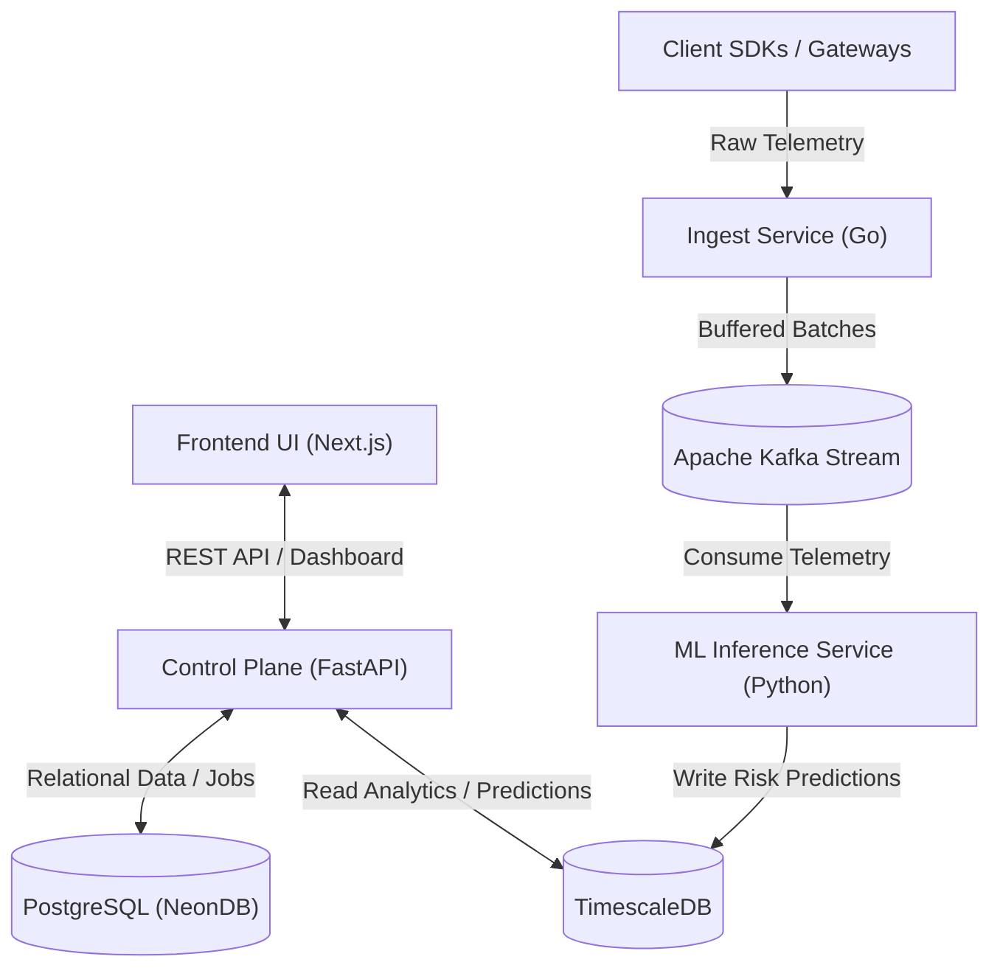

  

# `ApiCortex`

> **Autonomous API Failure Prediction & Contract Testing SaaS Platform**

  

## ✧ Overview

ApiCortex is an advanced, cloud-native Software-as-a-Service (SaaS) platform designed specifically to shift API reliability from traditional reactive monitoring to an intelligent predictive model. Targeting modern microservice and API-first organizations, ApiCortex seamlessly combines high-throughput telemetry ingestion, distributed time-series analytics, machine learning (ML), and automated contract testing into a unified reliability engine.

By passively observing network traffic via SDKs and lightweight Gateways, ApiCortex is uniquely positioned to forecast API degradations, schema drift, or critical cascading failures well before they impact downstream consumers or end users.

### ⌖ The Value Proposition
⟡   **Predictive, Not Reactive**: Leverages advanced Machine Learning (XGBoost) combined with SHAP explainability matrices to forecast anomalies based on fine-grained rolling windows of latency, structural error rates, and subtle schema drift.  
⟡   **Zero-Impact Passive Observation**: Eliminates the bottleneck of inline proxies. Your traffic flows normally and efficiently while telemetry is safely buffered and processed entirely asynchronously.  
⟡   **Intelligent Continual Contracts**: Automatically extracts and continuously tests your OpenAPI specifications against raw incoming JSON payload structures to identify and prevent silent breaking changes.  
⟡   **Built for True Multi-Tenancy**: Engineered for SaaS scale from day one, featuring Organization-scoped Role-Based Access Control (RBAC), deeply integrated OAuth SSO, and granular Plan-based capacity enforcement.  

---

## ✦ Architecture & Core Components

ApiCortex heavily embraces the **Separation of Concerns** principle, cleanly distributing computing workloads into three highly resilient, domain-specific backend planes. Each plane is independently scalable and fault-tolerant:

### 1. The Data Plane: Ingest Tier (`Go 1.25+`)
⟡   **High-Throughput Receiver**: A massively concurrent HTTP server hyper-optimized to accept and instantly acknowledge massive bursts of telemetry (`telemetry.raw`) POST requests.  
⟡   **In-Memory Batching Queue**: Utilizes native Go channels and strict `sync.Mutex` locks to safely construct compressed (Gzip) multi-event payloads, protecting downstream systems by returning graceful `429 Too Many Requests` backpressure signals if saturated.  
⟡   **Hardened Edge Security**: Implements constant-time SHA256 API Key hashing and distributed Token Bucket IP-based Rate Limiting to prevent sophisticated DDoS or brute-force identity attacks natively at the edge.  
⟡   **Kafka Publisher**: Guarantees idempotent, at-least-once, and load-balanced message delivery directly into centralized Aiven Kafka event streams.  

### 2. The Control Plane: API Orchestration (`Python / FastAPI`)
⟡   **Auth & Tenant Management**: Deep OAuth2 integration (Google/GitHub native flows) governing secure JWT HttpOnly cookies and strictly isolated Organization membership constraints.  
⟡   **SaaS Tier Enforcement**: Custom interception middleware that automatically restricts the number of registered APIs and data limits a tenant can provision depending on their actively billed subscription plan.  
⟡   **Contract Intelligence Engine**: Ingests and rigorously parses uploaded Swagger/OpenAPI models. Extracts structured endpoint geometries and generates deterministic, cryptographic `schema_hash` identifiers for O(1) drift comparisons.  
⟡   **Transactional Resilience**: Implements an advanced Postgres `FOR UPDATE SKIP LOCKED` transaction queue, acting as an atomic, asynchronous background worker fallback for durable job execution.  
⟡   **Analytics Bridging Engine**: Intelligently routes heavy dashboard aggregation requests (such as fetching P95 latency distributions or unexpected error spikes over 30 days) straight to the TimescaleDB columnstore for immediate execution.  

### 3. The ML Plane: Predictive Intelligence (`Python / XGBoost`)
⟡   **Non-Blocking Event Integration**: Utilizes a highly optimized `asyncio` (`uvloop`) event loop to read immense raw Kafka batches continuously without I/O blocking.  
⟡   **Rolling Feature Engine**: Tracks complex 1-minute, 5-minute, and 15-minute sliding statistical windows (latency variance, request volume deltas) completely in-memory, providing instantaneous anomaly feature extraction without database querying overhead.  
⟡   **XGBoost Inference Pipeline**: Classifies real-time traffic behavior continuously into `normal`, `degraded`, or `high_failure_risk` categorizations based on historically trained models.  
⟡   **SHAP Explainability Insights**: Integrates TreeExplainer methodologies to directly expose exactly *why* an alert triggered (identifying the specific feature, such as an unexpected schema mutation heavily correlating with a sporadic 500ms latency spike).  
⟡   **Timescale Data Push**: Synchronously and durably persists prediction histories and risk vectors into a specialized `api_failure_predictions` TimescaleDB hypertable, ready to be immediately rendered by the frontend UI.  

---

## ⚙ Technology Stack

| Domain | Core Technologies & Frameworks |
| :--- | :--- |
| **Ingest & Edge Processing** | Go (1.25+), Standard `net/http`, Waitgroups & Channels, `segmentio/kafka-go` |
| **Control & Identity Logic** | Python (3.11), FastAPI (Async), SQLAlchemy ORM, Pydantic v2 validation, OAuth Ecosystems |
| **Machine Learning & Inference** | XGBoost Classification, Scikit-Learn Data Pipes, Pandas, SHAP Feature Explainability |
| **Event Streaming & Buffers** | Apache Kafka (Managed by Aiven), Snappy / Gzip Lossless Compression standards |
| **Transactional State Store** | PostgreSQL (NeonDB Serverless) |
| **Time-Series Metric Matrix** | TimescaleDB |
| **Presentation & UI** | Next.js 16+ (App Router), React, Tailwind CSS |
| **Environment & CI/CD**| Docker Containers, GitHub Actions automation, OpenTelemetry Observability |
| **Javascript Package Manager**| `Bun 1.3.4` (Ensuring a strict speed standard across future JS implementations) |

---

## ⛨ Enterprise Security Practices
⟡   **Zero PII Collection Philosophy**: Incoming payload bodies are aggressively obfuscated or hashed at the source; only structured system metrics (Latency, Request Size, Status Codes, Schema Signatures) ever enter the ApiCortex data plane.  
⟡   **Encrypted Transits Framework**: Mandatory TLS Verification on every internal Kafka connection; `sslmode=require` rigorously enforced across all Postgres and Timescale routing connections.  
⟡   **Granular SaaS Guardrails**: Organization-scoped RBAC mathematically separating Owners, Admins, and standard Members strictly within the core SQLAlchemy ORM database level filters.  
⟡   **Pre-emptive Defensive Parsing**: Edge endpoints aggressively analyze and reject malformed JSON Blobs or packets exceeding strict memory allocations natively, intercepting threats before they ever unmarshal inside the Go ingest tier.  

---

## ❯ Getting Started

*(Detailed deployment architecture schemas and drop-in SDK documentation to be provided upon Front-End integration completion.)*

Currently, all core backend infrastructure ecosystems—**Control Plane (Python)**, **Ingest Service (Go)**, and **ML Inference Worker (Python)**-are fully architected, completely built, and continuously operating in a flawlessly issue-free state, waiting for the final Presentation UI (Next.js) web application connection.